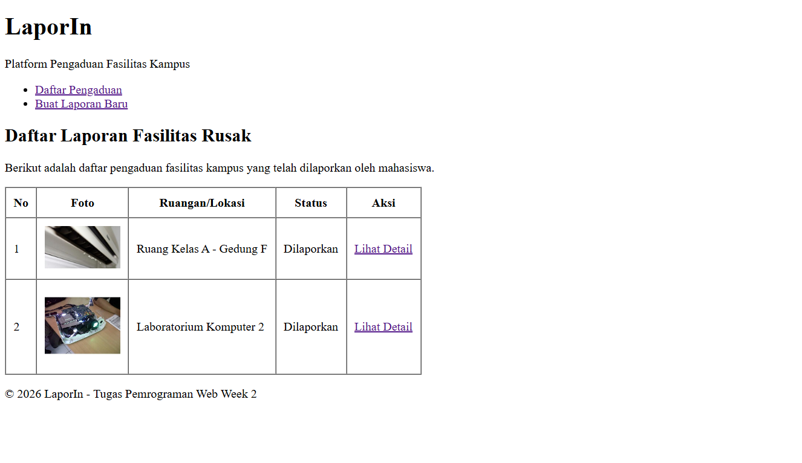
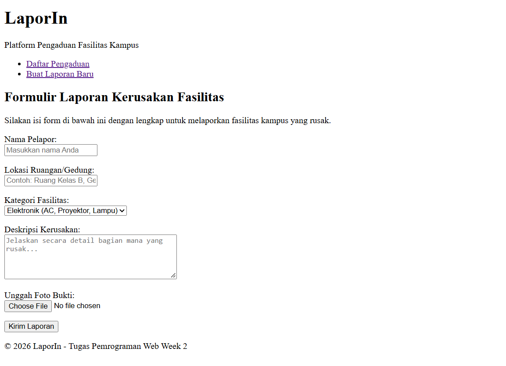
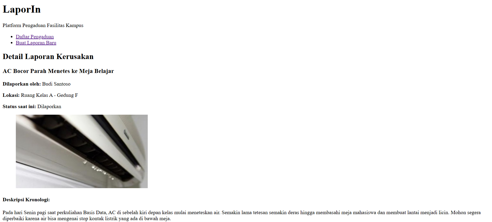
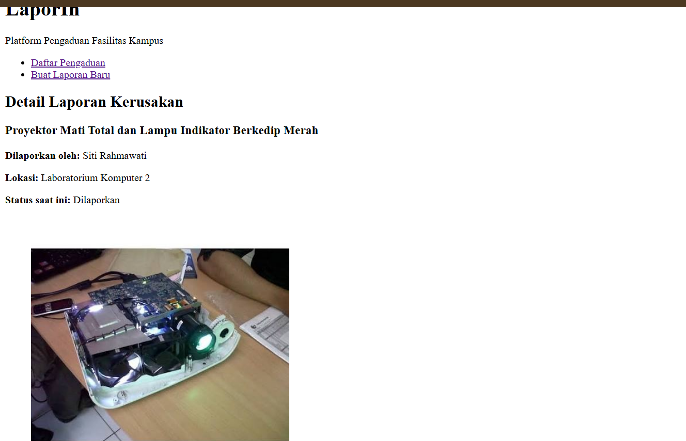

# LaporKampus - Platform Pengaduan Fasilitas Kampus

Aplikasi web murni berbasis HTML5 untuk memudahkan mahasiswa melaporkan kerusakan fasilitas di lingkungan kampus. Proyek ini merupakan tugas Week 2 HTML mata kuliah Pemrograman Web.

## Struktur Halaman Web
1. `index.html`: Halaman utama berisi tabel daftar pengaduan fasilitas kampus.
2. `form.html`: Halaman formulir untuk menginput pengaduan kerusakan fasilitas baru.
3. `detail1.html`: Halaman detail untuk rincian laporan kerusakan AC.
4. `detail2.html`: Halaman detail untuk rincian laporan kerusakan Proyektor.

## Fitur & Elemen HTML yang Diterapkan
- **Semantic HTML5**: Menggunakan `<header>`, `<nav>`, `<main>`, `<article>`, `<figure>`, dan `<footer>`.
- **Formulir Laporan**: Menggunakan elemen `<input>`, `<select>`, `<textarea>`, dan `<label>` yang terhubung (`for` & `id`).
- **Data Tabular**: Menampilkan daftar laporan dalam bentuk `<table>`.
- **Aksesibilitas**: Penggunaan atribut `alt` yang deskriptif pada setiap elemen ``.

## Screenshot Tampilan Halaman
> Catatan: Tampilan masih berupa struktur HTML murni (tanpa styling CSS).

### 1. Halaman Utama / Daftar Pengaduan (`index.html`)

### 2. Halaman Form Pengaduan (`form.html`)

### 3. Halaman Detail Pengaduan (`detail1.html`)
*

### 4. Halaman Detail Pengaduan (`detail2.html`)

---
&copy; 2026 LaporIn - Tugas Pemrograman Web